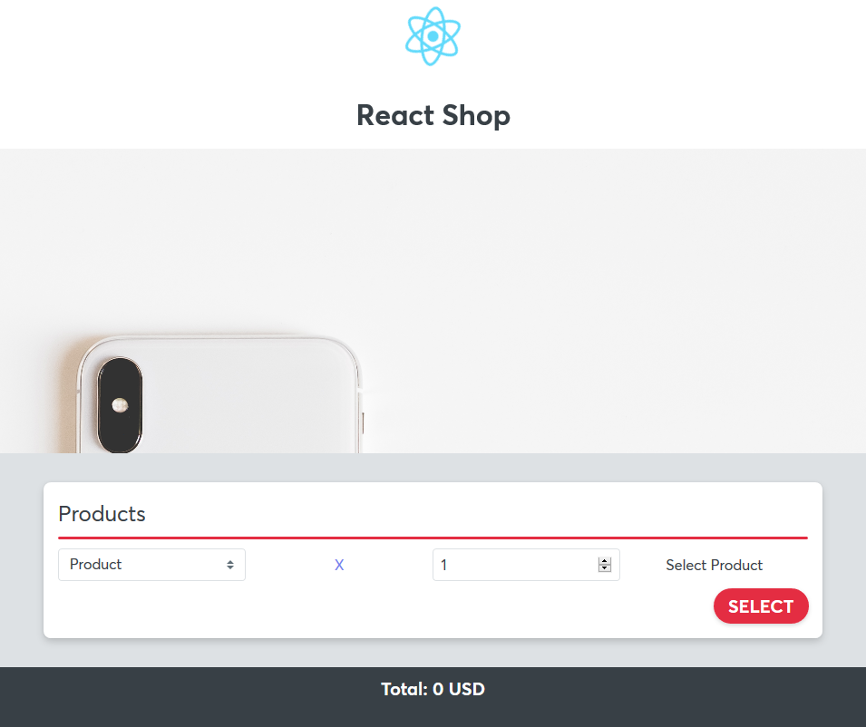
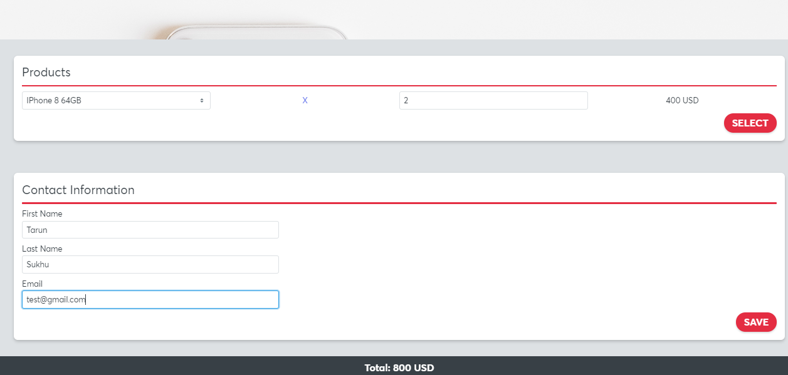
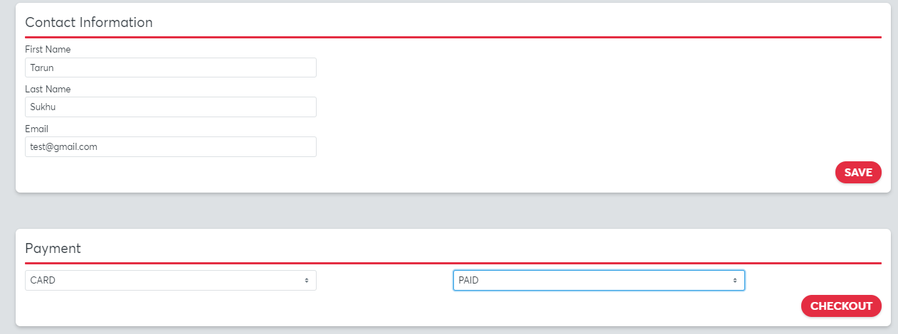

# mobx-react-ts-app

React app based on MobX Typescript And Styled components

- This web app depicts the "Progressive Disclosure Pattern" using a use case of React Mobile Shopping experience
- The user journey (Single Page Checkout)
  - Select a product and the quantity
  - Enter the user contact information
  - Make the payment
  - On successful payment we can finally complete the checkout process
- The user state is maintained in the MobX store and as the user progresses further the components are progressively shown based on where the user journey has reached.
- Since this is a concept demonstration there are no validations added.
- MobX features used
  - Created a single store
  - Use the @computed field for the Cart Total
  - All global state change is done via @actions method calls. ( We do have local form components which maintain its local state internally)
  - Use the 'reaction' API for clearing the order once the checkout is complete
- This application also uses styledcomponents and @hackclub/design-system which is part of the same ecosystem

## Demo

- See live demo [here](https://festive-goldwasser-162887.netlify.com/)

## Screenshots

- Landing Page and Product Selection

- Contact Info after product is selected (The computed value of total is also updated)

- Payment Info after contact details

- Final Checkout

